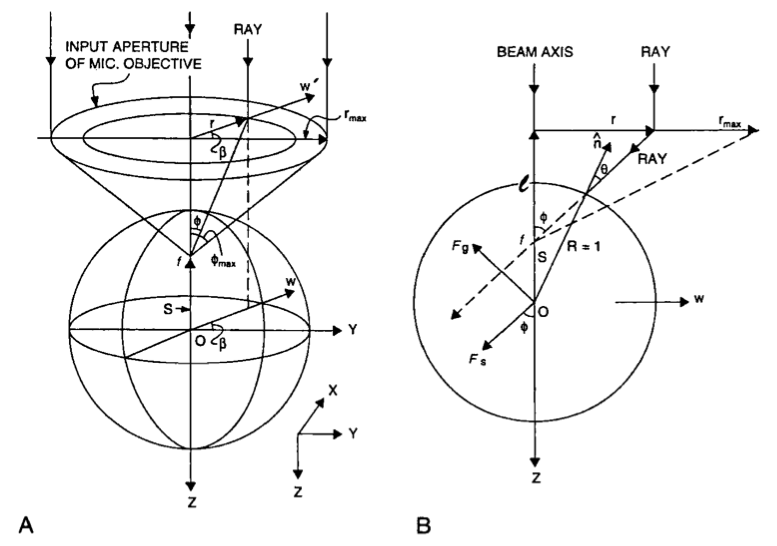
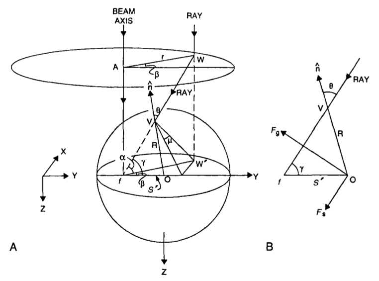

# Optical Trap Forces

*Read in [Russian](README_RU.md)*

This repository contains Python and Matlab code for calculating a single-beam laser trap, also called an optical tweezer, capturing a micrometer dielectric sphere. This can be considered as a simple model of a system describing the laser capture and manipulation of living organisms and organelles inside cells. The gradient force and the scattering force are determined for a beam with a uniform intensity distribution of Gaussian and Bessel beams (uniform beam and Bessel beam are only in the code).

For dielectric spheres with a diameter much larger than the wavelength, geometric optics can be used to calculate the forces acting on it from the beam side. The light beam is decomposed into separate beams, each with its own intensity value, direction and polarization state. They propagate in straight lines in a homogeneous medium with a uniform refractive index. There are no diffraction effects in this consideration.

A simple geometrical-optical model of a single-beam gradient trap is shown in Fig. 1.

The trap consists of an incident parallel beam of a better arbitrary mode composition and polarization, which falls into a high-aperture micro lens and focuses in focus $f$. The maximum angle of deflection of the rays at the output of a micro lens is determined by its numerical aperture

$$NA = n_1 \cdot \sin{\sigma_A}$$

where $n_1$ – refraction index of the medium;

$\sigma$ – aperture angle [rad].

For a typical water immersion lens with a value of $NA = 1.25$ and $n_1 = 1.33$, the maximum beam deflection angle at the output of the micro lens will be equal to

$$\phi_{max} = \arcsin{\frac{NA}{n_1}} = 70^\circ$$

For a single beam with a power of $P$ incident on a dielectric sphere at an angle of incidence of $\theta$ with a momentum of $\frac{n_1 P}{c}$ ($c$ is the speed of light in vacuum), the forces it exerts on the sphere are determined by the formulas:

$$F_s = \frac{n_1 P}{c} \left[ 1 + R \cos{2\theta} - \frac{T^2[\cos(2\theta - 2r) + R\cos{2\theta}]}{1 + R^2 + 2R\cos{2r}} \right] = \frac{n_1 P}{c} Q_s$$

$$F_g = \frac{n_1 P}{c} \left[ R \sin{2\theta} - \frac{T^2[\sin(2\theta - 2r) + R\sin{2\theta}]}{1 + R^2 + 2R\cos{2r}} \right] = \frac{n_1 P}{c} Q_g$$

where $F_s$ – scattering force [N];

$F_g$ – gradient force (return force) [N];

$Q_s$ и $Q_g$ – the effectiveness of these forces, respectively;

$\theta$ и $r$ – angles of incidence and reflection, respectively [рад];

$R$ и $T$ – reflection and transmission coefficients determined by Fresnel formulas:

$$R(\theta, \psi) = R_{\perp} \cos{\psi} + R_{\parallel} \sin{\psi} = \frac{\sin^2(\theta - r)}{\sin^2(\theta + r)}\sin{\psi} + \frac{\tan^2(\theta - r)}{\tan^2(\theta + r)}\cos{\psi}$$

$$T(\theta, \psi) = 1 - R(\theta, \psi)$$

where $\psi$ – the angle of rotation of the polarization plane [rad].

The angles of incidence and reflection are related by Snell's law:

$$n_1 \sin{\theta} = n_2 \sin{r}$$

where $n_2$ – refractive index of the sphere material.

The force $F_g$ is a useful force that returns the particle to the equilibrium position. $F_s$ is the force pushing the particle out of the trap. $F_g$ must be greater than $F_s$ for stable capture.

It can be seen that the forces acting on the particle depend on the polarization of light, because Fresnel coefficients depend on it.

## Ray efficiency

Let's plot the efficiencies $Q$ of the forces obtained. We introduce the relative refractive index $n = \frac{n_2}{n_1}$. For the calculation, we will use the values $NA = 1.25$, from where $\phi_{max} = 70^\circ$; $n_1 = 1.33$; $𝑛 = 1.2$, from where $n_2 = 1.6$ (polystyrene). The value of $f$ and the radius of the particle do not need to be introduced, because in geometrical-optical consideration, the result does not depend on their values.

In Fig. 2 $Q = \sqrt{Q_s^2 +Q_g^2}$ is the efficiency of the resulting force acting on the particle. This graph shows the contribution of each ray incident on a particle at a certain angle. It can be seen that the maximum value of $Q_g$ is approximately at the value of the angle of incidence of $70^\circ$, which shows the need to use high values of $NA$. For comparison, we present graphs for other $n$ in Fig. 3 and 4.

It can be seen that at $n\rightarrow 1$ the required maximum angle of incidence becomes too high, and at $n\rightarrow 1.4$ $Q_s$ is equal to or exceeds $Q_g$ in most of the angle range, which indicates the difficulty of obtaining a stable capture.

## Force along Z-axis

To obtain the resulting force acting on the particle, it is necessary to sum up the contribution of all rays, i.e. integrate. The integration is carried out in a cylindrical coordinate system, therefore, the Jacobian is equal to $J = r$. The projections of the forces $F_g$ and $F_s$ on the $Z$ axis in this case are defined as

$$F_{gZ} = -F_g \sin{\phi}$$
$$F_{sZ} = F_s \cos{\phi}$$

Angle $\phi$ is the angle of deflection of the beam after passing the micro lens (see Fig. 1). The angle of incidence $\theta$ is defined as

$$\theta = \arcsin\left(\frac{z}{a} \sin{\phi}\right)$$

Thus, the resulting force acting on the particle along the axis $Z$ is determined by the integral

$$F_Z^\Sigma = \frac{1}{\pi r_{max}} \int_{0}^{2\pi} \int_{0}^{r_{max}} (F_{gZ} + F_{sZ}) r d\beta dr$$

where $r_{max} = f \tan{\phi_{max}}$.

Similarly, the individual components of the gradient force and the scattering force are determined by the following integrals:

$$F_{gZ}^\Sigma = \frac{1}{\pi r_{max}} \int_{0}^{2\pi} \int_{0}^{r_{max}} F_{gZ} r d\beta dr$$

$$F_{sZ}^\Sigma = \frac{1}{\pi r_{max}} \int_{0}^{2\pi} \int_{0}^{r_{max}} F_{sZ} r d\beta dr$$

where $\frac{1}{\pi r_{max}^2}$ is a normalization coefficient.

The efficiencies of forces acting along the $Z$ $Q_{tz}$, $Q_{gz}$, $Q_{sz}$ axis are similarly obtained by dividing the forces by $\frac{n_1 P}{c}$.

Let's build graphs based on the data given above (Fig. 5).

It can be seen from the graph that when the particle is displaced from the equilibrium position, the forces that return the particle back grow. The force acquires maximum values in the coordinates $z = -1.06\ \mu m$ and $z = 1.02\ \mu m$. The stability of the capture and the rigidity of the trap depend on the specific values of these forces. It can also be noticed that the equilibrium position of the particle is slightly shifted relative to zero and that due to symmetry in this case, the force does not depend on the polarization of light.

## Force along Y-axis

In the same way, forces acting in the lateral plane can be obtained. Here we consider the $Y$ axis, but the same consideration is valid for displacement along any direction in a plane perpendicular to the direction of the laser beam. However, in this case, new angles appear, shown in Fig. 6.

*Test Caption*

They are determined by the following formulas:

$$\alpha = 90^\circ - \arctan{\frac{r}{f}}$$

$$\gamma = \arccos\left(\cos{\alpha} \cos{\beta}\right)$$

$$\theta = \arcsin\left(\frac{y}{a} \sin{\gamma}\right)$$

$$\mu = \arccos\left(\frac{\tan{\alpha}}{\tan{\gamma}}\right)$$

In this case, the forces acting on the particle will depend on the polarization. The contribution of each polarization is determined by the coefficients

$$f_\parallel = \left(\cos{\beta} \sin{\mu - \sin{\beta} \cos{\mu}}\right)^2$$

$$f_\perp = \left(\cos{\beta} \cos{\mu - \sin{\beta} \sin{\mu}}\right)^2$$

However, we will assume that the light has circular polarization, then

$$f_\parallel = f_\perp = 1/2$$

Here the projections of forces on the axis $Y$ are defined by the following expressions:

$$F_{gY} = F_g \cos{\phi}$$

$$F_{sY} = F_s \sin{\gamma}$$

And the corresponding integrals are defined by these expressions:

$$F_Y^\Sigma = \frac{1}{\pi r_{max}} \int_{0}^{2\pi} \int_{0}^{r_{max}} (F_{gY} + F_{sY}) r d\beta dr$$

$$F_{gY}^\Sigma = \frac{1}{\pi r_{max}} \int_{0}^{2\pi} \int_{0}^{r_{max}} F_{gY} r d\beta dr$$

$$F_{sY}^\Sigma = \frac{1}{\pi r_{max}} \int_{0}^{2\pi} \int_{0}^{r_{max}} F_{sY} r d\beta dr$$

Using the same data, we will plot the efficiencies of forces along the $Y$ axis.

It can be seen that the returning force acts symmetrically when the particle is displaced, and the equilibrium position is already at zero.

## The effect of a Gaussian beam on a spherical particle

In the case of a Gaussian beam (the main $TEM_{00}$ mode), the intensity distribution is as follows:

$$I(r) = \exp\left(-\frac{2r^2}{w_0}\right)$$

Graphs of forces acting along the $Z$ and $Y$ axes under the condition $\varepsilon = 1.0\ (w_0 = r_{max})$ are shown in Fig. 7 and 8.

Calculate the distributions for other values of $\varepsilon$ and summarize the data in Table 1. In this table, the value $A = 1 - \exp\left(-\frac{2r_{max}^2}{w_0}\right)$ is the fraction of power that falls on the input pupil of the micro lens. 

Table 1. Efficiency of the forces of the Gaussian beam at different coefficients of filling the entrance pupil of the micro lens.

|$\varepsilon$|$A$|$Q_{-z}^{max}$|$-Z_{max},\ \mu m$|$Q_y^{max}$|$Y_{max},\ \mu m$|$Q_{+z}^{max}$|$-Z_{max},\ \mu m$|$S_{E},\ \mu m$|
|---|---|---|---|---|---|---|---|---|
|1,7|0,5|-0,188|1,02|0,272|0,98|0,336|1,06|0,08|
|1,0|0,86|-0,098|1,04|0,182|0,98|0,180|1,06|0,1|
|0,727|0,98|-0,048|1,04|0,124|0,98|0,091|1,06|0,13|
|0,364|1,0|-0,005|1,16|0,044|0,98|0,014|1,3|0,31|
|0,202|1,0|-0,001|1,44|0,016|0,98|0,003|1,9|0,81|

Table 1 shows that the trap with $\varepsilon = 1.7$ has the highest value of the release force $Q_{-z}^{max} = 0.336$. It is also seen that the trap with $\varepsilon = 1.7$ is the most homogeneous trap, because it has the smallest difference between the forces of $Q_{-z}^{max}$ and $Q_{+z}^{max}$. However, it is worth considering the fact that with such a ratio of the beam radius to the lens aperture, the power falling on the particle (see the value $A$ in Table 2) decreases. Therefore, the optimal cases are $\varepsilon = 1.0$ and $\varepsilon = 0.727$, since most of the power will be concentrated in the beam.

## How to use

Everything described above is designed in the form of Python and Matlab files:

- Rays efficiencies: [trap_forces_efficiencies.py](Python/trap_forces_efficiencies.py) and [trap_forces_efficiencies.m](Matlab/trap_forces_efficiencies.m)

- Forces along $Z$ axis: [trap_forces_axial.py](Python/trap_forces_axial.py) and [trap_forces_axial.m](Matlab/trap_forces_axial.m)

- Forces along $Y$ axis: [trap_forces_transverse.py](Python/trap_forces_transverse.py) and [trap_forces_transverse.m](Matlab/trap_forces_transverse.m)

Launch one of these files, and the graphs will be plotted. You can change initial constants and do your experiments.

## References

- [A. Ashkin. Forces of a Single-Beam Gradient Laser Trap on a Dielectric Sphere in the Ray Optics Regime (1997). DOI: 10.1016/S0091-679X(08)60399-4](https://www.sciencedirect.com/science/article/abs/pii/S0091679X08603994)